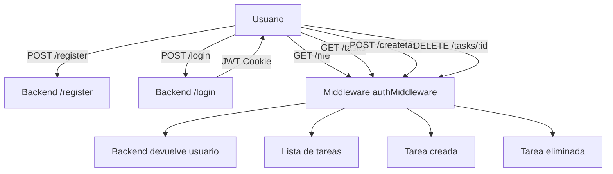

# Proyecto de Gestión de Tareas

Este proyecto es una aplicación web para gestionar tareas, construida con **Angular 20** en el frontend y **Node.js / Express con MySQL** en el backend, usando **Knex** para consultas a la base de datos y **JWT** para autenticación.

---

## 🔹 Tecnologías utilizadas

**Backend:**

- Node.js + Express
- MySQL (base de datos)
- Knex (query builder)
- Sequelize (ORM opcional para otras tablas)
- JWT (JSON Web Token) para autenticación
- Middleware `authMiddleware` para proteger rutas
- Bcryptjs para hashing de contraseñas
- Cors y cookie-parser para manejo de cookies y solicitudes cross-origin

**Frontend:**

- Angular 20 (standalone components)
- HttpClient para consumir la API
- FormsModule para manejo de formularios
- Routing y navegación entre Login, Registro y Dashboard

---

## 🔹 Estructura de Rutas del Backend

Se crearon **7 rutas principales** más un middleware para proteger rutas:

### Rutas de autenticación

| Método | Ruta       | Descripción                       |
|--------|------------|-----------------------------------|
| POST   | /register  | Registrar un nuevo usuario         |
| POST   | /login     | Iniciar sesión                     |
| POST   | /logout    | Cerrar sesión                      |
| GET    | /me        | Obtener datos del usuario logueado (protegida) |

### Rutas de tareas (protegidas con `authMiddleware`)

| Método | Ruta             | Descripción                       |
|--------|-----------------|-----------------------------------|
| GET    | /tasks           | Obtener todas las tareas del usuario logueado |
| POST   | /createtask      | Crear una nueva tarea             |
| DELETE | /tasks/:id       | Eliminar una tarea por su ID      |

> Todas las rutas de `/tasks` y `/me` requieren que el usuario esté autenticado mediante JWT en cookies.

---

## 🔹 Diagrama de flujo de autenticación y rutas



---

## 🔹 Instalación y ejecución

### Backend

1. Entrar a la carpeta del backend:

```bash
cd server
```

2. Instalar dependencias:

```bash
npm install
```

3. Configurar el archivo `.env` con tus credenciales de MySQL y la clave secreta JWT:

```
DB_HOST=localhost
DB_USER=tu_usuario
DB_PASSWORD=tu_contraseña
DB_NAME=tu_base_de_datos
JWT_SECRET=tu_clave_secreta
PORT=3001
```

4. Iniciar el servidor:

```bash
npm start
```

El backend correrá en: `http://localhost:3001`

---

### Frontend

1. Entrar a la carpeta del frontend:

```bash
cd client
```

2. Instalar dependencias:

```bash
npm install
```

3. Iniciar la aplicación Angular:

```bash
ng serve -o
```

El frontend correrá en: `http://localhost:4200`

> Angular se comunica con el backend usando cookies para autenticación (`withCredentials: true`).

---

## 🔹 Uso

1. Abrir el navegador en `http://localhost:4200`.
2. Registrarse o iniciar sesión.
3. Acceder al **Dashboard**, donde podrás:
   - Ver tu información de usuario.
   - Crear nuevas tareas.
   - Listar tareas existentes.
   - Eliminar tareas.
4. Cerrar sesión con el botón correspondiente.

---

## 🔹 Ejemplos visuales

**Dashboard con listado de tareas:**

```
+----------------------------------------------------+
| Bienvenido al Dashboard 🎉                          |
| Nombre: Juan Pérez                                  |
| Email: juan@mail.com                                |
| Dirección: Calle Falsa 123                           |
| Edad: 28 Años                                       |
| [Cerrar sesión]                                     |
+----------------------------------------------------+
| Crear nueva tarea: [Título] [Descripción] [Crear]  |
+----------------------------------------------------+
| Mis tareas                                         |
| # | Título          | Descripción       | Acción  |
| 1 | Comprar leche   | Supermercado      | Eliminar|
| 2 | Llamar a Juan   | Confirmar reunión | Eliminar|
+----------------------------------------------------+
```

**Mensajes de estado:**

- `Cargando tareas...` → mientras se carga la lista
- `Aún no tienes tareas` → si no hay tareas creadas

---

## 🔹 Notas adicionales

- Todas las rutas de tareas y la ruta `/me` están protegidas con el middleware `authMiddleware`.
- Se utiliza **JWT almacenado en cookies** para mantener la sesión activa.
- Las tareas se ordenan de forma descendente por su ID (más recientes primero).
- Los botones y inputs siguen la misma paleta de colores que el registro/inicio de sesión (`#36aeea`).

---

### Autor

Alexis Piña